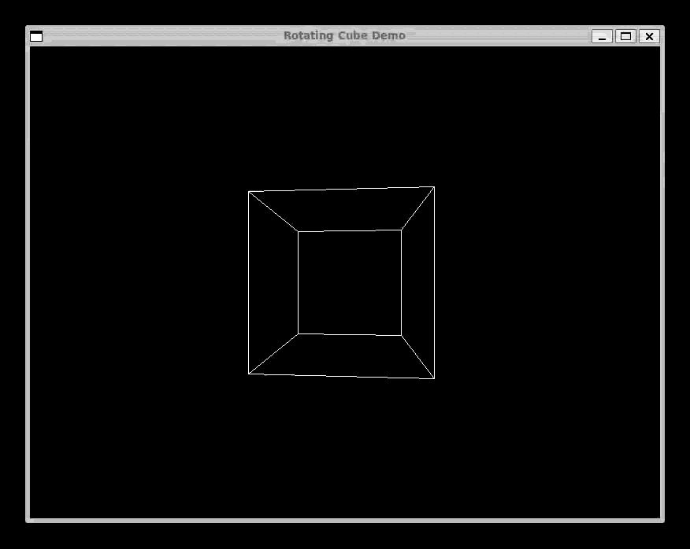

# Complect - A Toy Compiler


Complect is a toy compiler developed in Node.js. It operates as an async generator-based compiler, processing code incrementally with push-like data flow for efficiency and modularity. Complect supports multiple backends: transpilation to JavaScript using Babel AST, and compilation to LLVM IR for native code generation. The pluggable backend architecture enables easy addition of WebAssembly, custom interpreters, and other targets.

The initial implementation of this compiler was created to support a talk I presented at **OpenJS World 2022**. You can find the contents of this talk here. [Slides](https://static.sched.com/hosted_files/openjsworld2022/78/OpenJSW%20World%202022.pdf) [Video](https://youtu.be/aPHf_-N2yTU)

## Demo

Below is an example of the `fixtures/sdl-cube` demo application compiled with the LLVM backend, linked with sdl2. We have graphics.



## Stages
- Preprocessor: Transforms an input stream into a sequence of preprocessing tokens yielded incrementally.
- Tokenizer: Converts the sequence of preprocessing tokens into a sequence of tokens yielded incrementally.
- Abstract Syntax Tree (AST): Generates an intermediate representation (IR) from the sequence of tokens.
- Output: Pluggable backends convert IR to JavaScript (via Babel AST) or LLVM IR for native compilation.

## Design
Complect utilizes a handcrafted parser and lexer to give developers fine-grained control over the compilation process. The parser in Complect is a top-down parser of the LL(1) type, chosen for its simplicity and efficiency in parsing.

### Key Design Elements
- Handcrafted Parser and Lexer: Complect's components are manually written, unlike tools-generated parsers and lexers. This allows for greater customization and optimization specific to the language's needs.

- Top-Down Parsing (LL(1)): Complect's choice of a top-down parser of the LL(1) type is not arbitrary. This parsing method, which proceeds from left to right and produces a leftmost derivation with a single token lookahead, is known for its efficiency and simplicity. The grammar of the Complect language has been meticulously designed to facilitate this type of parsing, ensuring that parsing decisions can be made with minimal lookahead.

- Async Generator-Based Compilation: The compiler processes code using async generators, yielding tokens and AST nodes incrementally for efficiency and modularity. This design supports asynchronous processing and easier debugging, with stages pushing data to the next via iteration (e.g., preprocessor yields tokens to tokenizer). While not a pure stream, it balances performance for large inputs with simplicity for a toy compiler.

- LLVM IR Generation: Complect can generate LLVM Intermediate Representation for native code compilation using clang or llc.

- Modular AST Generation: The architecture supports pluggable backends via an intermediate representation (IR), enabling output to JavaScript, LLVM IR, WebAssembly, or custom interpreters.

- Full Language Support: Both backends support the complete Complect language including integers, strings, arithmetic, concatenation, comparisons, and control flow.

### Future
- Additional backends: WebAssembly (Binaryen), custom interpreters
- Compiler optimization passes
- Enhanced language features

## Usage
### CLI
You can use Complect as a command-line tool. The entry point of the application is `bin/cli.js`.

```bash
# Show help
complect --help

# Compile from stdin to stdout (default: babel backend)
cat program | complect

# Compile from file to stdout
complect --file program

# Compile to specific backend
complect --file program --backend llvm

# Compile to file
complect --file program --output program.js
complect --file program --backend llvm --output program.ll
```

#### LLVM IR Usage
When using the LLVM backend, Complect generates LLVM Intermediate Representation (.ll) files that can be compiled to native binaries:

```bash
# Generate LLVM IR
complect --file fib --backend llvm --output fib.ll

# Compile to assembly (for inspection)
llc fib.ll -o fib.s

# Compile to executable binary
clang fib.ll -o fib

# Run the binary
./fib
```

### Testing
Tests are written using Node's built-in test module.
`npm run test`

### Linting
Linting is done using ESLint.
`npm run lint`

## Language
### Keywords and Usage
Complect supports basic programming constructs including variables (`make`), assignments (`assign` for simple values, `=` for expressions), conditionals (`if`/`endif`), loops (`as`/`repeat`), and output (`print`). The language is evolving as the parser develops—expect changes.

#### Current Limitations
Expressions are currently limited to binary operations; simple assignments (e.g., `f = 5`) are not yet supported and require `assign`. The grammar is designed for LL(1) parsing with minimal lookahead.

### FizzBuzz in Complect
```
make i 1
make f 0
make b 0
make output ''

as i <= 16
  f = i % 3
  b = i % 5
  assign output ''
  if f == 0
    output = output + 'Fizz'
  endif
  if b == 0
    output = output + 'Buzz'
  endif
  if output == ''
    output = output + i
  endif
  print output
  i = i + 1
repeat
```
## Author
Complect is created by Jarrod Connolly.

## License
MIT License

See [LICENSE](LICENSE) for the full license text.